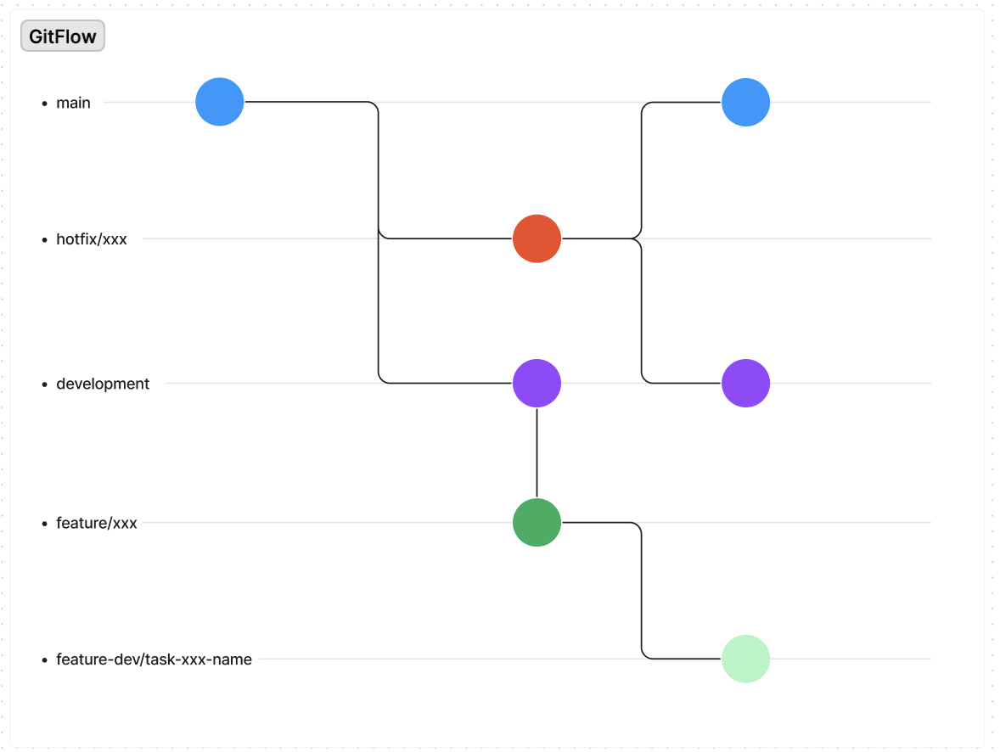

<h1 align="center">
    Projeto Integrador - Front-end
</h1>

<p align="center">
<a href="#tecnologias-e-ambiente-de-desenvolvimento">Tecnologias e setup ambiente</a>&nbsp;&nbsp;&nbsp;|&nbsp;&nbsp;&nbsp;
  <a href="#instalação">Instalação</a>&nbsp;&nbsp;&nbsp;|&nbsp;&nbsp;&nbsp;
   <a href="#gitflow">Gitflow</a>&nbsp;&nbsp;&nbsp;|&nbsp;&nbsp;&nbsp;
  <a href="#commits-e-pull-requests">Commits e Pull Requests</a>&nbsp;&nbsp;&nbsp;|&nbsp;&nbsp;&nbsp;
  <a href="#-padrões-gerais-javascript/typescript">Padrões Gerais</a>&nbsp;&nbsp;&nbsp;
</p>

## Tecnologias e Ambiente de desenvolvimento

Para usar e testar o aplicação, você já deve ter configurado o ambiente de desenvolvimento para aplicações Web. Você pode seguir a seguinte documentação para configurar seu ambiente:

[Tecnologias e setup de ambiente de desenvolvimento](https://docs.google.com/document/d/1WClG3w5OpQ9Sj8q0K-TgkWTbGAcl2866bthzD9igvwI/edit?usp=sharing)
## Instalação

```bash
# Instalar dependências
$ npm install

# Rodar a aplicação
$ npm run dev

# Rodar testes
$ npm run test:watch

# Rodar build
$ npm run build
```


## Gitflow

O Gitflow é apenas uma ideia abstrata do fluxo de trabalho Git, ou seja, ele dita que tipos de ramificações configurar e como fazer o merge.

Trabalharemos com branchs:

- branch master: É a branch principal do projeto que deverá ser versão mais estável.

- branch feature: É a branch que será desenvolvido as User Story. Uma branch feature, poderá está relacionado a uma única User Story ou várias User Story. Caso seja encontrado um bug na feature durante os testes de qualidade, não será considerado um bugfix e sim uma feature.

- branch feature-dev: É a branch que será desenvolvido as tasks. Uma branch feature-dev poderá está relacionado a uma task ou várias tasks

- hotfix: É a branch usada para melhorias emergências, com aprovação dos responsáveis do projeto.

<h1 align="center" width="25vw" >
    
</h1>

## Commits e Pull Requests

1. Antes de começar a codar crie sua branch a partir da branch feature/xxx com o seguinte comando: 
```bash
    git checkout -b feature-dev/task-xxx-name origin/feature/xxx
```
2. Após realizar todas as alterações necessárias na branch realize o commit com o comando:

```bash
    npm run commit
```
    2.1. Caso seja apresentado algum erro no commit verifique o código, corrija o erro e realize o commit novamente

3. Com o commit realizado, faça o push para a branch, utilize o comando:

```bash
    git push origin feature-dev/task-xxx-name 
```

4. Por último crie o PR no github selecionado a sua branch feature-dev/task-xxx-name e apontando para a branch feature/xxx.

## Padrões Gerais JavaScript/TypeScript

1. Use lint (ou outro style checker).
2. Nunca desabilite uma regra de lint arbitrariamente.
3. Use nomes descritivos, mesmo que sejam longos.
    
    Evite abreviações, principalmente se a variável for usada em um contexto amplo. Em contextos curtos *pode* ser aceitável (p. ex. uma função lambda).
    
    Evite ambiguidades.
    
    **Pense bem antes de atribuir um nome:**
    
    ```tsx
    const c = 0; // 👎
    const userActivityCounter = 0; // 👍
    ```
    
    ```tsx
    const admins = usersList.filter(u => u.isAdmin()); // 👍 mas vamos evitar
    const admins = usersList.filter(user => user.isAdmin()); // 👍
    ```
    
    ```tsx
    const projectData = {};
    const dataProject = {}; // 👎 se estiverem no mesmo contexto
    ```
    
4. Nomes de variáveis devem ser substantivos, pois representam coisas.
    
    ```tsx
    const user = {};
    const counter = 0;
    const houses = [];
    ```
    
5. Nomes de funções devem conter verbos, pois representam ações.
    
    ```tsx
    function saveFormChanges() {}
    function handleKeyboardEvent() {}
    function createNewTemplate() {}
    ```
    
6. Funções que retornam valor lógicos, em geral podem usar `is` e `has`.
    
    ```tsx
    function isActive() {}
    function hasRole(role) {}
    ```